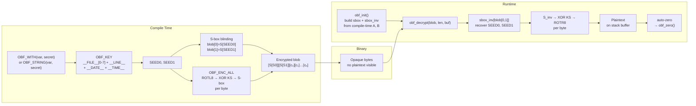
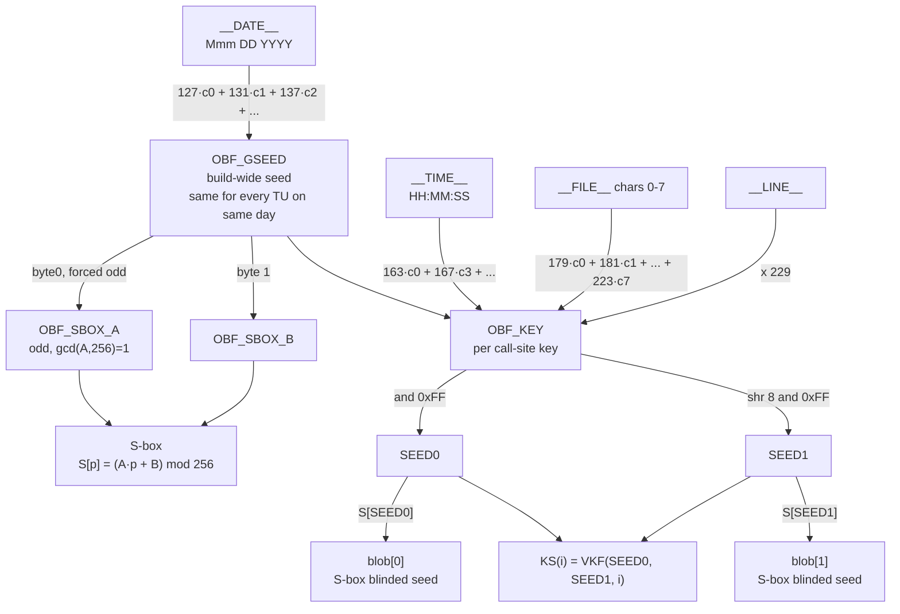
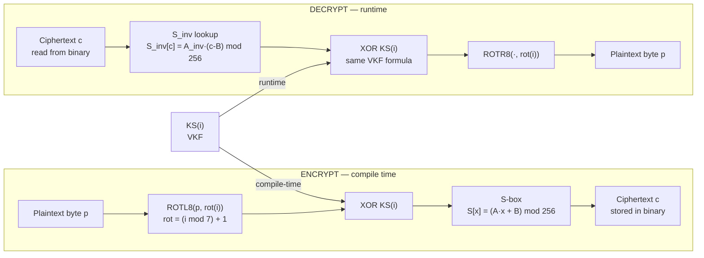
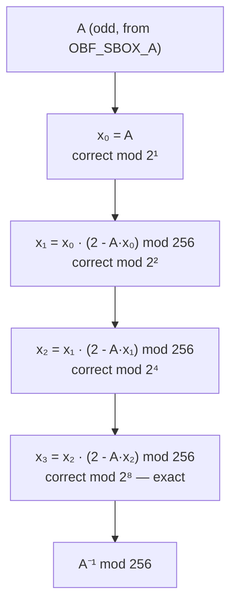
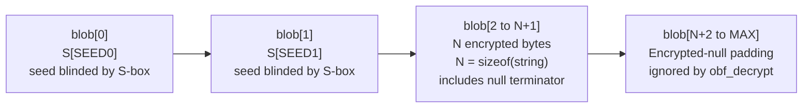
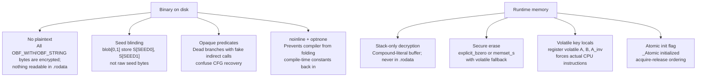

# VORTEX Cipher — Algorithm Specification

VORTEX is a custom symmetric stream cipher designed for **compile-time string encryption** in C. It is not intended as a general-purpose cryptographic primitive — its goal is binary hardening: making sensitive constants invisible to static analysis tools such as `strings`, IDA Pro, and Ghidra.

---

## End-to-End Lifecycle

The diagram below shows the full flow from source code through the compiled binary to runtime decryption:




---

## Key Model

### Two-tier key derivation

VORTEX uses two independent keys serving different roles:




| Key         | Derived from                                        | Scope         | Purpose                          |
| ----------- | --------------------------------------------------- | ------------- | -------------------------------- |
| `OBF_GSEED` | `__DATE__` only                                     | Entire build  | S-box parameters A and B         |
| `OBF_KEY`   | `__FILE__[0-7]`, `__LINE__`, `__DATE__`, `__TIME__` | One call site | Per-string keystream SEED0/SEED1 |


Using `__DATE__` alone for `OBF_GSEED` keeps the S-box **identical across all translation units** compiled on the same day, preventing decrypt failures in parallel builds where `__TIME__` can differ by seconds.

`OBF_KEY` mixes the first **eight** characters of `__FILE__` (chars 0–7), each multiplied by a distinct prime (179–223).  Using eight characters instead of four greatly reduces key collisions between files that share a  
common directory prefix.

Because `__LINE__` is part of `OBF_KEY`, two `OBF_WITH` or `OBF_STRING` calls on **different lines** produce different ciphertexts for identical plaintext.

---

## Per-Byte Transform

### Encryption (compile-time) and Decryption (runtime)




### Step detail


| Step | Encrypt                  | Decrypt                              |
| ---- | ------------------------ | ------------------------------------ |
| 1    | `ROTL8(p, (i%7)+1)`      | `S_inv[c]`                           |
| 2    | `XOR KS(i)`              | `XOR KS(i)`                          |
| 3    | `S[result]` → ciphertext | `ROTR8(result, (i%7)+1)` → plaintext |


The same `KS(i)` value is used in both directions — no separate key expansion is needed.

---

## S-box Construction

The S-box is an **affine bijection over GF(2⁸)**:

```
S[p] = (A · p + B) mod 256
```

where `A = OBF_GSEED_BYTE0 | 1` (LSB forced to 1 so A is always odd) and `B = OBF_GSEED_BYTE1`. Because `gcd(A, 256) = 1`, S is a permutation.

### Modular Inverse via Newton's Method

`A_inv` (needed for `S_inv`) is computed by iterating:

```
x ← x · (2 − A·x)  mod 256
```

Three steps double the precision each time, reaching exact `A⁻¹ mod 2⁸`:




Example: `A = 3` → `x = 3 → 235 → 171 → 171`.
Verify: `3 · 171 = 513 = 2·256 + 1` ✓

The same three steps are encoded in the compile-time `OBF_MODINV256(a)` macro.

---

## VORTEX Keystream Function (VKF)

Rather than dispatching through a 32-entry key table (which generates an exponentially large AST at compile time), the hot path uses a single O(1) arithmetic formula:

```
KS(i) = (SEED0 · (89i + 1)  +  SEED1 · (97i + 3)  +  167i + 251) mod 256
```

- **89** is a Fibonacci number; **97** is prime. The pair produces different linear contributions per position, making SEED0 and SEED1 independently influence each keystream byte.
- **167** and **251** are prime.

This is a compile-time constant when `i` is a literal integer (always true inside `OBF_ENC_ALL`). The runtime decrypt path uses the **identical formula** inline, so no expansion table is stored in the binary.

The conceptual Fibonacci-like key schedule it approximates:

```
K[0] = SEED0
K[1] = SEED1
K[n] = (7 · K[n-1]  +  13 · K[n-2]  +  n · 17  +  31) mod 256,   n ≥ 2
```

The reference macros `OBF_K0`…`OBF_K31` in `include/vortex/cipher.h` encode the closed-form coefficients for verification.

---

## Blob Format

Every encrypted blob produced by `OBF_WITH`, `OBF_STRING`, or `OBF_ENC_ALL`
follows this layout:




`blob[0]` and `blob[1]` store the per-string seed bytes passed through the compile-time S-box (`S[SEED0]`, `S[SEED1]`), so that raw seed values are not directly visible in the binary.  `obf_decrypt` recovers the seeds via
`sbox_inv` before running the keystream, then decrypts exactly `len − 2` bytes starting at `blob[2]`.

---

## Anti-Analysis Properties




| Technique                 | Mechanism                                                                                |
| ------------------------- | ---------------------------------------------------------------------------------------- |
| No plaintext in `.rodata` | Every blob is fully encrypted — only opaque bytes appear                                 |
| Seed blinding             | `blob[0..1]` store `S[SEED0]`/`S[SEED1]`; raw seeds are not in the binary                |
| Stack-only output         | C11 compound-literal on the caller's stack, never in `.rodata`                           |
| Volatile key material     | `register volatile` locals in `obf_init()` force actual multiply/add instructions        |
| Secure erase              | `obf_zero()` uses `explicit_bzero` / `memset_s` where available, with volatile fallback  |
| Opaque predicates         | `OBF_OPAQUE_PRED()` inserts an unreachable branch with a null function-pointer call      |
| Split control flow        | `obf_decrypt_bytes()` is a separate `noinline` function — fragments the call graph       |
| `optnone`                 | Decrypt functions opt out of optimisation — compiler cannot refold constants             |
| Thread-safe init          | `_Atomic int initialized` with acquire/release ensures correct visibility across threads |


---

## Security Scope

VORTEX is a **binary hardening** tool, not a cryptographic cipher:

- It does not protect against an attacker with live access to the running process.
- It does not replace TLS, authenticated encryption, or key management.
- It makes **static analysis** significantly harder by removing plaintext from the binary.
- Seed blinding (`S[SEED0]`/`S[SEED1]` in the blob) means the keystream cannot be reconstructed without first recovering the S-box parameters (A, B) from the build date.
- Keys are derived from build metadata (`__FILE__[0-7]`, `__LINE__`, `__DATE__`, `__TIME__`); a determined attacker who can reconstruct the exact source layout and build timestamp could still reverse the keystream, but the wider `__FILE__` coverage increases per-string key uniqueness.

